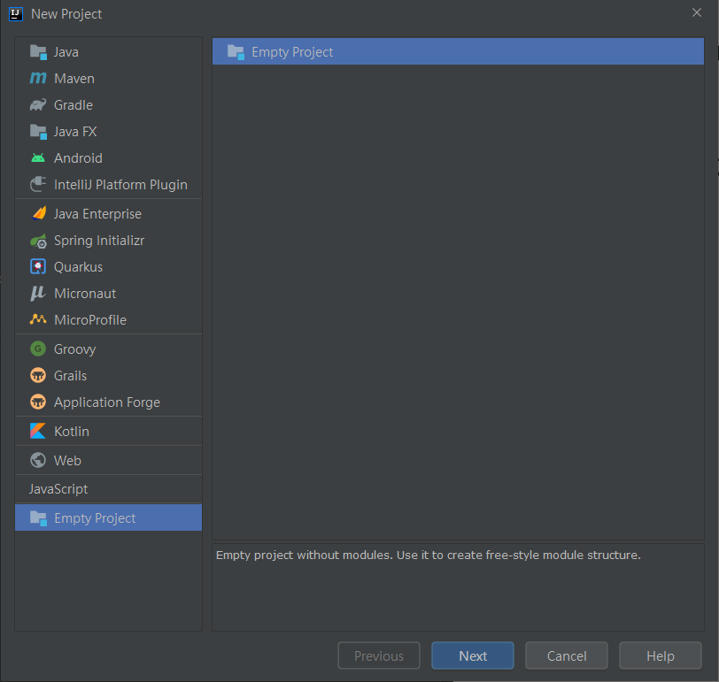
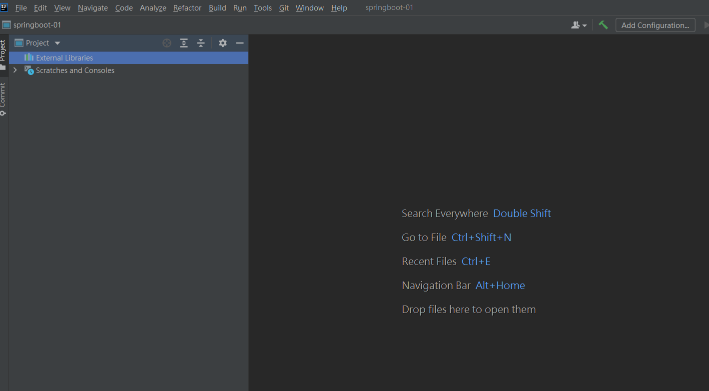
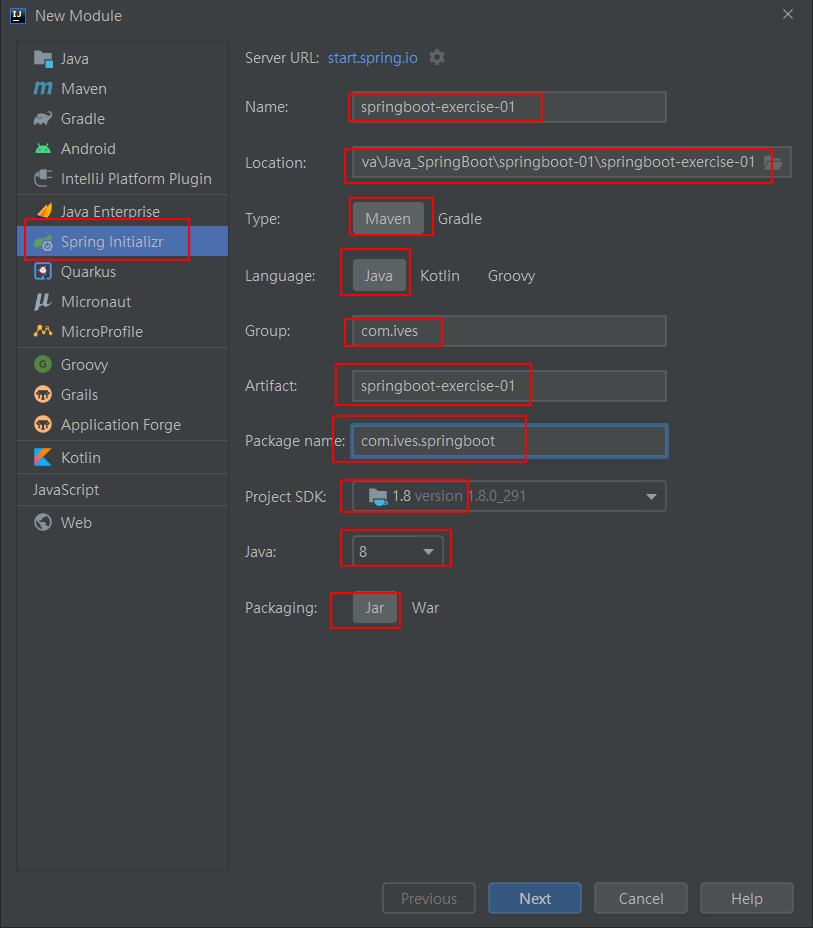
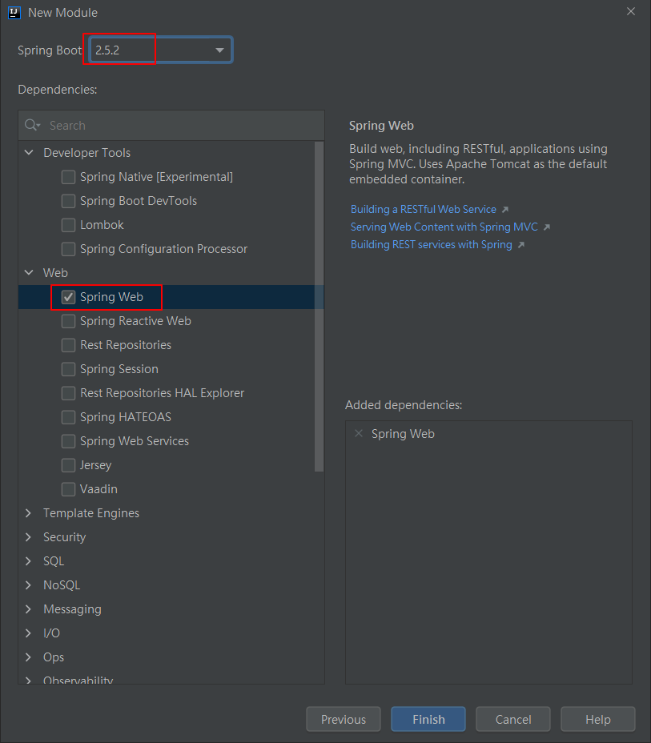
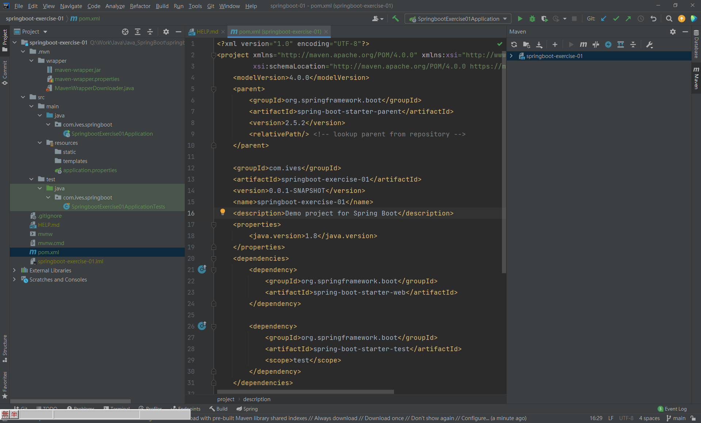
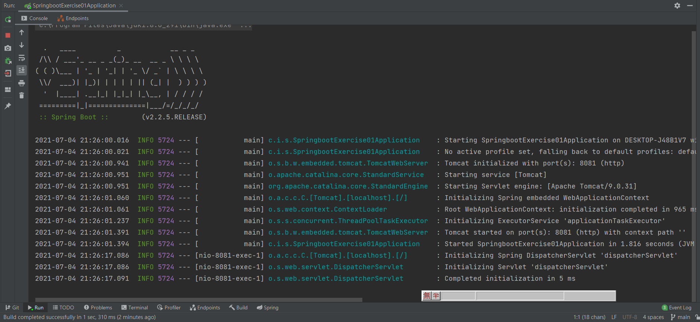

# Java SpringBoot

SpringBoot筆記

# SpringBoot 四大核心

1. 自動配置
2. 起步依賴
3. Actuator
4. 命令行界面

# 創建一個空專案





# 創建一個SpringBoot模塊







# 創建controller類

IndexController.java

```java
@Controller
public class IndexController {
    @RequestMapping(value = "springboot/say")
    public @ResponseBody String say(){
        return "哈囉，SpringBoot";
    }
}
```

# 修改端口號

application.properties

```properties
server.port = 8081
```

# 測試結果

運行



成功訪問

